r# Thermal risk prediction methodology for conceptual design of aircraft equipment bays

Florian Sanchez *, Susan Liscouët-Hanke

Concordia University, Department of Mechanical, Industrial and Aerospace Engineering, Montreal, Quebec, H3G1M8, Canada

## A R T I C L E I N F O

Article history:

Received 19 December 2019

Received in revised form 30 March 2020

Accepted 1 April 2020

Available online 12 June 2020

Communicated by Mehdi Ghoreyshi

## A B S T R A C T

Early thermal analysis is becoming increasingly important, in particular for more electric, hybrid electric or all electric aircraft in combination with novel vehicle concepts. Traditionally, aircraft thermal analyses are performed later in the design process, when the aircraft system architecture is already defined, which can lead to costly modifications and delays late in the design process. Thus, assessing thermal risk during the conceptual design phase represents a way to anticipate changes in the design process. This research paper presents an innovative approach using dimensionless numbers to predict system thermal risk for the conceptual design of aircraft equipment bays. The article presents two realistic case studies, a business jet aft equipment bay and a rotorcraft nose equipment bay. The validation with computational fluid dynamic simulations demonstrates novel the capabilities of this thermal risk assessment. In summary, the proposed approach will improve the definition of thermal requirements during the aircraft conceptual design phase and will reduce the risk of potential thermal issues later in the design process.

© 2020 Elsevier Masson SAS. All rights reserved.

## 1. Introduction

During the aircraft development process, many design decisions depend upon a good understanding of thermal aspects, such as thermal management of aircraft systems and components, qualification of equipment and reliability predictions [1]. A prerequisite for a consistent system thermal integration is the availability of a suitable model of the aircraft system architecture and the associated heat loads generated during various flight phases [2]. This is even more important in the context of more electric, hybrid electric or all-electric aircraft [3], as the amount of embedded power and the associated losses (resulting in heat generation) increase. This increased heat generation occurs at the system level for more-electrical systems [4] but also at the aircraft level with the novel hybrid and fully electric propulsion architectures [5]. Therefore, the system thermal integration must be part of the multi-disciplinary aircraft design process, to address the increasing integration between disciplines [6]. Previous research projects developed several thermal modelling methodologies suitable for the aircraft preliminary and detailed design phases such as the MAAXIMUS [7] and TOICA [8] European projects. Furthermore, several studies have addressed the optimization of the locations of critical aerospace systems and components in a crown compartment of an aircraft (confined area between the passenger cabin and the external fuselage) [9] or in the nose equipment bay of a rotorcraft [10]. These studies use high fidelity Computational Fluid Dynamics (CFD) analysis, which is not suitable for Multidisciplinary Design and Optimization (MDO) in conceptual design. Thus, a significant gap remains for the system thermal integration during the conceptual design phase. Recently, the authors proposed a thermal risk assessment approach which allows the prediction of equipment thermal risk during aircraft conceptual design [11]. The authors define thermal risk as the potential of non-compliance with thermal requirements (e.g. exceeding the maximum allowable skin temperature of a component or exceeding the maximum allowable bay temperature). The thermal risk of an aerospace equipment depends on the following aspects:

- The equipment bay characteristics, which consist in its geometrical definition and the number of inlets and outlets.

- The operating conditions, which consist in the external environment of the zone under study.

- The system characteristics, which are the sizes and locations but also the heat loads values.

---

* Corresponding author.

E-mail address: florian.sanchez@mail.concordia.ca (F. Sanchez).

---

## Nomenclature

AEB aft-equipment bay

CFD computational fluid dynamics

DN dimensionless numbers

FEM finite element method

MDO multidisciplinary design optimization

A Area of the considered element

$b$ subscript related to the bay

bw subscript related to the bottom wall

Cp heat capacity of air. J/kg/K

$D$ diameter m

env subscript related to the environment

$F$ view factor of the consider element

fan subscript related to the fan

$g$ gravitational acceleration $\mathrm{m}/{\mathrm{s}}^{2}$

in subscript related to the inlet

$k$ thermal conductivity of air ................... W/m/K

$L$ characteristic length used in dimensionless numbers m

out subscript related to the outlet $p$ perimeter of the considered element sys subscript related to the system tw subscript related to the top wall X horizontal location of the considered element Y vertical location of the considered element $\beta$ thermal expansion coefficient of air ............. ${\mathrm{K}}^{-1}$

${\Delta \theta }$ temperature difference ....................... ${}^{ \circ  }\mathrm{C}$ or $\mathrm{K}$

density of air ................................. $\mathrm{{kg}}/{\mathrm{m}}^{3}$

dynamic viscosity of air $\mathrm{{kg}}/\mathrm{m}/\mathrm{s}$

heat flux generated by the systems’ heat loads $\mathrm{W}/{\mathrm{m}}^{2}$

The authors propose to use dimensionless numbers (DN) to conduct thermal analysis during the conceptual design phase. DN are supported by dimensional analysis and the Buckingham theorem [12] and they provide low fidelity evaluations of cooling flow problems based on analyses of the relevant physical phenomena [13] which make them suitable for aircraft conceptual design.

Previous research work already used dimensional analysis and the DN to model an aircraft fuel thermal management system [14], or to assess the temperature stratification of an aircraft zone; for example a stratification factor has been introduced to assess the temperature stratification status of cryogenic storage tanks for two different shapes [15]. Other studies used DN to characterize the temperature stratification of a water tank [16], or to characterize the flow regime of complex flow configurations [17] and complex geometrical configurations [18]. However, the aircraft equipment bays are generally more complex than the case studies already investigated in the literature: more systems and components with various geometrical shapes and several inlets and outlets. Thus, using DN in aircraft conceptual design represents a challenge especially when various geometrical configurations of the aircraft and the system architecture need to be analysed. Indeed, at this stage the aircraft system architecture is not defined, and the engineer must be able to evaluate the influences of the systems integration (i.e. their location within the bay). Moreover, previous studies demonstrated the influence of the relative position of heat and ventilation sources within a cavity on the cooling efficiency of electronic components [10,19]. These studies show that the location of a component and the ventilation sources within an equipment bay are the key parameters when the objective is to achieve an optimal cooling configuration. Therefore, the proposed approach uses dimensionless geometrical ratios derived from the system and ventilation geometrical characteristics (sizes and locations) to consider the influences of the system integration in the equipment bay.

The purpose of this paper is to extend the current use of DN for qualitative thermal analyses of aircraft equipment bays to support the thermal risk assessment of aircraft system during the conceptual design phase. The first part of the paper describes the workflow developed to predict the thermal risk of specific system architectures. The different categories of necessary inputs data are introduced and discussed. First, the capabilities of using DN to assess the ventilation, stratification and system integration aspects are described and discussed using a simple case study. Following, the authors propose, a penalty point-based approach to convert the previous analyses into a thermal risk prediction. The last part of this paper presents two complex and realistic case studies. The first case study covers a complex aft equipment bay of a business aircraft which has been conducted in the scope of a collaborative project between Concordia University and Bombardier Aviation. The second case study consists in a rotorcraft nose equipment bay based on [10]. For both cases, CFD simulation results are used to validate the thermal risk predictions obtained using the proposed approach.

Table 1

Parameters values used for the simple case study.

<table><tr><td>${X}_{sys}$</td><td>${Y}_{sys}$</td><td>Mflow</td></tr><tr><td>0.25 m</td><td>0.13 m</td><td>0.05 kg/s</td></tr><tr><td>0.75 m</td><td>0.5 m</td><td>0.15 kg/s</td></tr><tr><td>1.25 m</td><td>0.88 m</td><td>0.25 kg/s</td></tr></table>

## 2. Thermal risk assessment approach

This section introduces a workflow to predict the thermal risk of a considered aircraft equipment zone (Fig. 3). The first subsection describes the different type of data and discusses the potential approaches or sources of data to consider. Secondly, the ventilation and stratification analyses, and the system integration aspects are discussed using a simple case study that consists in a rectangular box located in a simplified equipment bay with one inlet and one outlet (Fig. 2). A full factorial design of experiments is used to define all the simulated configurations specified by Table 1, in total 27 configurations were obtained. Finally, a penalty point-based approach is introduced to convert the thermal analyses into a quantifiable thermal risk.

### 2.1. Input data

The thermal risk assessment approach requires three categories of inputs data to predict the system thermal risk during the conceptual design phase. Table 2 gives an overview of the necessary input data for the thermal risk assessment of an aircraft zone. It also shows the parameters which are derived from the input data and the potential sources of the inputs.

The first type of data concerns aircraft zone characteristics, which consist in the geometrical configuration of the zone and the number of ventilation sources (inlets or outlets). Here, a three-dimensional (3D) geometrical representation of the studied zone is required. It can be a 3D CAD model generated using CAD software, such as Dassault CATIA [20], Pro Engineer [21] or OpenVSP [22], the geometrical representation can also come from specific methodology developed for the conceptual design phase [23].

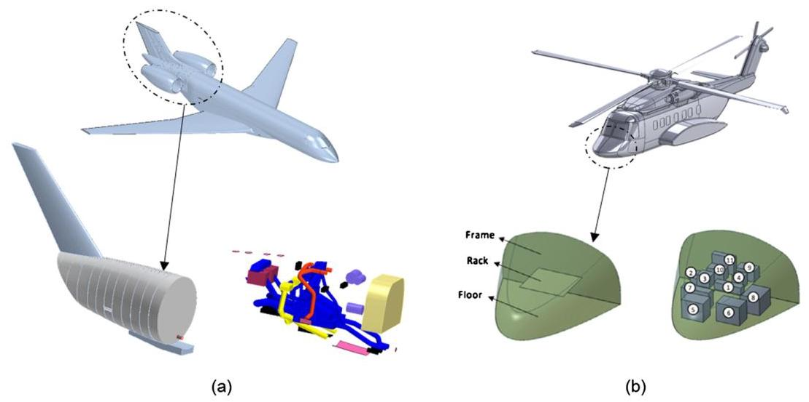

Fig. 1. Description of the two case studies: (a) Business Aircraft Aft Equipment Bay (case study from Bombardier Aviation), (b) Rotorcraft Nose Equipment Bay from [10].

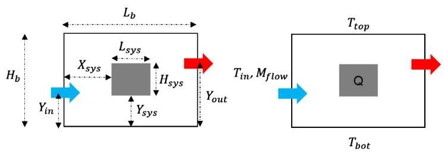

Fig. 2. Description of the main geometrical parameters and boundary conditions of the simplified case study.

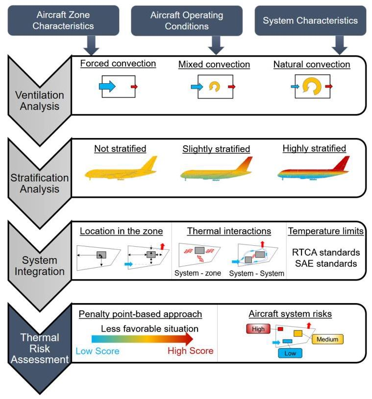

Fig. 3. Overview of the thermal risk assessment workflow.

The second type of input data covers the aircraft operating conditions, which define the aircraft internal and external environment. The radiative and convective exchanges with the environment must be evaluated to qualitatively estimate the fuselage skin temperatures and the solar loads on the aircraft. For example, flight and ground operations do not involve the same thermal environment for an aircraft. If no software or tools are available to estimate the aircraft environment, the engineers can refer to the SAE standard ARP1168/3A which provides methodology and data to model the aircraft thermal environment [24]. In this paper, 1D energy balance equations are used to estimate the aircraft environment using the suggested references.

The third type of input data consists of the system characteristics, such as their locations and sizes, their maximum admissible temperature and the heat loads generated under the specified aircraft operating conditions. The location and sizes of the system can be obtained from the 3D geometrical configuration of the aircraft zone if the systems are already modelled and placed in the zone. If the physical system architecture concept is not yet defined, the system integrator needs to define several concepts of the relative location of the systems under study with regards to the zone. The sizes of the system, if they are unknown, can be obtained from manufacturer datasheets for most of the aerospace system suppliers.

During the conceptual design phase, uncertainties related to structural and thermal aspects of the aircraft zone under study exist (and are normal) which affect some of the input parameters in the proposed approach. The internal structural elements of an aircraft zone, such as frames and stringers, are not yet optimized or the information related to their potential location and sizes may not be available too. Furthermore, for particular operating conditions, uncertainties related to the thermal loads from the environment on the aircraft structure can exist too. For example, during transonic or hypersonic flights the heat exchange between the fuselage skin and the external air flow are difficult to quantify. The uncertainty effects of the input parameters on the thermal risk prediction are not in the scope of the paper but the readers can consult the following references to consider the uncertainties during the thermal risk predictions [25,26].

Table 2 represents the smallest set of inputs for a thermal risk prediction; if some input data is not available the engineer or researcher can consider the missing input(s) as design variables to predict the thermal risk for several potential configurations. Then, the thermal risk prediction can be refined with additional information or using the results of a more detailed analysis during the next design phases.

### 2.2. Ventilation analysis

#### 2.2.1. Grashof, Reynolds and Richardson numbers definition

This first analysis identifies the main source of ventilation using the Richardson number in Eq. (1). This DN is derived from the Reynolds and Grashof numbers to compare natural and forced convection phenomenon and allows the characterization of the convection regime as natural, forced, or mixed [29]. It compares the buoyancy forces with the mixing forces involved in the volume under study.

$$
{Ri} = \frac{Gr}{R{e}^{2}} \tag{1}
$$

Table 2

Summary of the required input data to assess the thermal risk.

<table><tr><td>Category of inputs</td><td>Inputs</td><td>Derived inputs</td><td>Potential sources</td></tr><tr><td rowspan="4">Aircraft zone</td><td>Size</td><td>Areas, volume</td><td>CAD model and drawing</td></tr><tr><td>Maximum admissible temperature</td><td>-</td><td>RTCA DOE-160 [27]   SAE AIR1168/6A [28]</td></tr><tr><td>Number of inlet(s) and outlet(s)</td><td>-</td><td>CAD model and drawing; Design variables of the study</td></tr><tr><td>Inlet(s), outlet(s) sizes   Inlet(s), outlet(s) locations</td><td>Areas   -</td><td></td></tr><tr><td rowspan="2">Aircraft operating conditions</td><td>Operation (ground or flight) Inlet(s), outlet(s) flow rate</td><td>Outside air temperature   -</td><td>Operating case under study Flight conditions, manufacturer data for pneumatic system and fans; Design variables of the study</td></tr><tr><td>Inlet(s) temperature   Solar loads   Sky and ground temperatures   Aircraft or wind speed</td><td>-   Fuselage skin temperatures Radiative heat fluxes   External heat transfer coefficient</td><td>Aircraft altitude and location   Operating case under study</td></tr><tr><td rowspan="3">Aircraft systems</td><td>Size   Heat loads</td><td>Areas, volumes   Heat flux density</td><td>CAD model and drawing   Estimation model;   Manufacturer data</td></tr><tr><td>Locations</td><td>-</td><td>CAD model and drawing</td></tr><tr><td>Maximum admissible temperature</td><td>-</td><td>RTCA DOE-160 [27]   SAE AIR1168/6A [28]</td></tr></table>

Previous studies identified the Richardson number as the best DN to characterize the temperature stratification of a water tank [16]. Other research works used the Richardson number to characterize the flow regime of complex flow configurations [17] and complex geometrical configurations [18] for fixed geometrical configurations. Thus, the proposed approach uses the Richardson, Grashof and Reynolds numbers to assess the ventilation and the stratification of an equipment bay.

The Grashof number assists the characterization of natural convection and it has two definitions. The first definition is based on the heat flux density that represents the buoyancy forces due to the heat dissipated by the equipment. The second definition is based on the temperature difference which represents the buoyancy forces due to the temperature difference between the top and bottom walls of the bay under study. However, the second definition of the Grashof number is valid only for the specific configuration discussed in the next section. On the other hand, the Reynolds number assists the characterization of forced convection and is derived from the inlet opening characteristics (size, mass flow rate). According to the Richardson number value, it is possible to know if the inlet mass flow rates are enough to fight against the buoyancy forces. Due to the very few input parameters, all available in conceptual design, the proposed ventilation analysis can be performed in the conceptual design phase. In this way, one may be able to define requirements of the opening's characteristics, such as size or mass flow rate, at the earliest design phase.

The complexity of an aircraft equipment bay (number of inlets and outlets, number of systems located within the bay that dissipate heat loads, different boundary temperatures, etc.) creates several challenges for the Richardson number evaluation.

The first challenge is the dependence of the temperature on air physical properties (heat loads, and multiple heat sources affect the volume-averaged temperature of the bay and make estimating the air physical properties difficult). As the fuselage temperature can be estimated from environmental conditions, the volume-averaged temperature is derived from it.

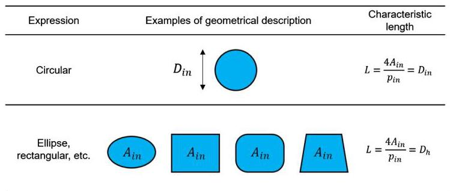

Fig. 4. Characteristic length definitions for the Reynolds number.

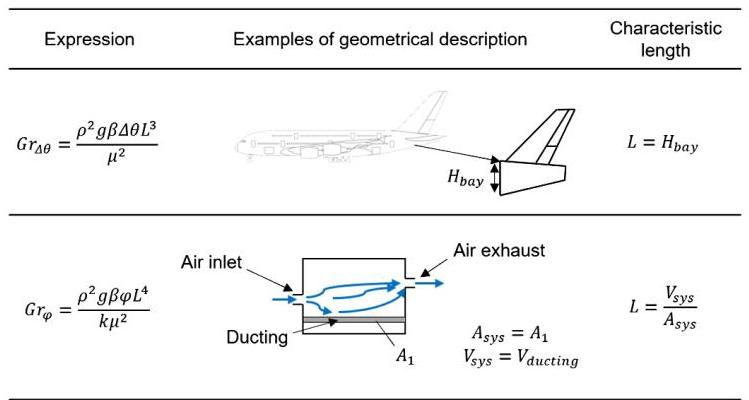

Fig. 5. Characteristic length definitions for the Grashof numbers.

The second challenge is the definition of the characteristic length $L$ for the DNs. For a complex aircraft equipment bay, the characteristic length can be defined in various ways. For the Reynolds number, the best approach is to use the hydraulic diameter as the characteristic length because it is valid for any shape of inlet opening and also for long and thin duct [30]. The hydraulic diameter is the ratio of the cross-sectional area of the inlet $\left( {A}_{in}\right)$ with its perimeter $\left( {p}_{in}\right)$ (Fig. 4). For the Grashof number $\left( {G{r}_{\varphi }}\right)$ number based on system heat loads, the number of systems and their geometry requires a suitable definition to consider their sizes and shapes. The authors investigated the following three characteristic lengths: the square root of the system exchange areas $\left( \sqrt{{A}_{\text{ sys }}}\right)$ , the cubic root of the system volume $\left( \sqrt[3]{{V}_{sys}}\right)$ and the ratio of the volume occupied by the systems $\left( {V}_{sys}\right)$ to the heat exchange areas $\left( {A}_{sys}\right)$ .

Table 3

Geometrical parameters and boundary conditions used for the case study.

<table><tr><td>${T}_{in}$</td><td>${T}_{top}$</td><td>${T}_{\text{ bot }}$</td><td>${H}_{sys}$</td><td>${L}_{sys}$</td><td>${H}_{bay}$</td><td>${L}_{bay}$</td><td>Q</td><td>${M}_{flow}$</td></tr><tr><td>25 °C</td><td>50 °C</td><td>30 °C</td><td>0.5 m</td><td>0.5 m</td><td>1.5 m</td><td>2 m</td><td>1500 W</td><td>\{0.05;0.15;0.25\} kg/s</td></tr></table>

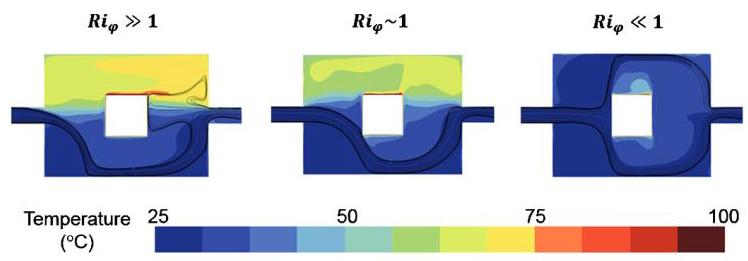

Fig. 6. CFD results from the case study for three ventilation configurations: natural (left), mixed (middle) and forced (right) - streamlines are represented by black lines.

The last one integrates the system sizes and shape variations and it has been defined as the characteristic length for the systems used within the Grashof number $\left( {G{r}_{\varphi }}\right)$ number based on system heat loads (Fig. 5). For the Grashof number $\left( {G{r}_{\Delta \theta }}\right)$ based on the temperature difference, the distance between the top and bottom walls of the bay under study, the height of the bay ${H}_{bay}$ , must be used as the characteristic length (Fig. 5).

#### 2.2.2. Ventilation analysis of a simple equipment bay

The case study described in Fig. 2 is used to show the effect of the ventilation on the temperature stratification and the mainstream flow. Thus, three CFD simulations are conducted for each ventilation configuration: natural, mixed and forced. Table 3 introduces the geometrical parameters and the boundary conditions of the studied configurations. For those simulations, the system is in the middle of the bay and the inlet and outlet are horizontally aligned with the system. Three different mass flow rates are considered to illustrate the three ventilation configurations and Fig. 6 introduces the CFD simulation results.

The CFD results show that the temperature stratification and the flow pattern are not the same according to the Richardson number values. Indeed, a Richardson number smaller than one means that natural convection is dominating, and that the inlet flow is not strong enough to mix the studied volume (Fig. 6 on the left). Moreover, a Richardson number close to one means that the natural and forced convection are competing and the resulting ventilation is mixed. In that case, the inlet flow can mix only a portion of the considered volume (Fig. 6 on the middle). Finally, a Richardson number higher than one means that forced convection is dominating and that the inlet flow is strong enough to mix the studied volume (Fig. 6 on the right). These simulations show that the Richardson number provides a valid qualitative assessment of ventilation.

### 2.3. Temperature stratification analysis

#### 2.3.1. Temperature stratification and stability of thermal gradient

Several temperature stratification situations might be possible, depending on the external environment and the amount of heat loads generated within the bay. The type of temperature stratification depends on the stability of the temperature gradient and, for an unstable temperature gradient, the source of natural convection. The stability of the thermal gradient depends on the temperature difference between the top and the bottom walls of the considered zone. Most aircraft zones encounter the higher temperature of the upper portion and lower temperatures at the lower portion. This situation leads to a stable temperature gradient, and there is no bulk fluid motion (Cf. Chapter 9 in [29]). However, the opposite situation might be observed for some zones under specific operating conditions (e.g. underfloor or belly fairing). In such cases, the Grashof number based on the temperature difference $\left( {G{r}_{\Delta \theta }}\right)$ must be considered and compared with one based on the system heat loads $\left( {G{r}_{\varphi }}\right)$ to identify the main source of natural convection. A ratio, ${R}_{\text{ nat }}$ , is introduced to compare those Grashof numbers (Eq. (2)).

$$
{R}_{\text{ nat }} = \frac{G{r}_{\Delta \theta }}{G{r}_{\varphi }} \tag{2}
$$

Table 4

Boundary conditions of the three different type of temperature stratification investigated.

<table><tr><td>Configuration</td><td>${T}_{\text{ in }}$</td><td>${T}_{top}$</td><td>${T}_{bot}$</td><td>Q</td><td>${M}_{flow}$</td></tr><tr><td>Stable ${\Delta \theta }$</td><td>${25}^{ \circ  }\mathrm{C}$</td><td>50 °C</td><td>30 ${}^{ \circ  }\mathrm{C}$</td><td>1500 W</td><td>${0.05}\mathrm{\;{kg}}/\mathrm{s}$</td></tr><tr><td>Unstable ${\Delta \theta }$ with ${R}_{\text{ nat }} > 1$</td><td>25 °C</td><td>30 °C</td><td>50 ${}^{ \circ  }\mathrm{C}$</td><td>1500 W</td><td>0.05 kg/s</td></tr><tr><td>Unstable ${\Delta \theta }$ with ${R}_{\text{ nat }} \leq  1$</td><td>25 °C</td><td>49 °C</td><td>50 ${}^{ \circ  }\mathrm{C}$</td><td>5000 W</td><td>${0.05}\mathrm{\;{kg}}/\mathrm{s}$</td></tr></table>

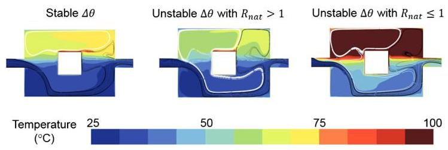

Fig. 7. CFD simulation results for the analysis of the thermal gradient stability - temperature field in ${}^{ \circ  }\mathrm{C}$ , inlet flow streamlines in black and bulk motion streamlines in white.

Three situations are possible:

- ${R}_{\text{ nat }} > 1$ : the natural convection driven by the temperature difference is stronger than that driven by heat loads.

- ${R}_{\text{ nat }} < 1$ : the natural convection driven by the heat loads is stronger than that driven by the temperature difference.

- ${R}_{\text{ nat }} \sim  1$ : the natural convection is driven by both the heat loads and the temperature difference.

#### 2.3.2. Stratification analysis of a simple equipment bay

The previous case study (Fig. 2) is used to show the differences between the different type of temperature stratification for the natural convection case $\left( {R{i}_{\varphi } \gg  1}\right)$ . Table 4 gives the boundary conditions used for the three different studied configurations and Fig. 7 introduces the CFD simulation results for the studied configurations.

The main effect of the thermal gradient instability is the level of temperature stratification in the bay under study. For the stable and unstable cases, the bulk motion deviates the inlet flow to the bottom part of the bay. On one hand, for the stable case, bulk motion is generated due to the heat loads and creates a recirculation cell located in the top of the bay (above the considered system). On the other hand, for the unstable cases, the recirculation cell is larger and occurs in the bottom part of the bay. Moreover, when the heat loads mainly drive natural convection, the bay is more stratified in the bottom part (below the system) than in the case of natural convection driven by the temperature difference. Thus, the stability of the thermal gradient must be considered regarding the location of a system or a component in an equipment bay, especially when it is in the top part of it.

Table 5

Example of the geometrical ratios used within the thermal risk assessment.

<table><tr><td>Related information</td><td>Horizontal relative location with the bay</td><td>Vertical relative location with the bay</td><td>Vertical relative location with the inlet</td><td>Vertical relative location with the outlet</td></tr><tr><td>Ratio</td><td>$\frac{{X}_{sys}}{{L}_{b}}$</td><td>$\frac{{Y}_{sys}}{{H}_{b}}$</td><td>$\frac{{Y}_{sys}}{{Y}_{in}}$</td><td>$\frac{{Y}_{sys}}{{Y}_{\text{ Out }}}$</td></tr></table>

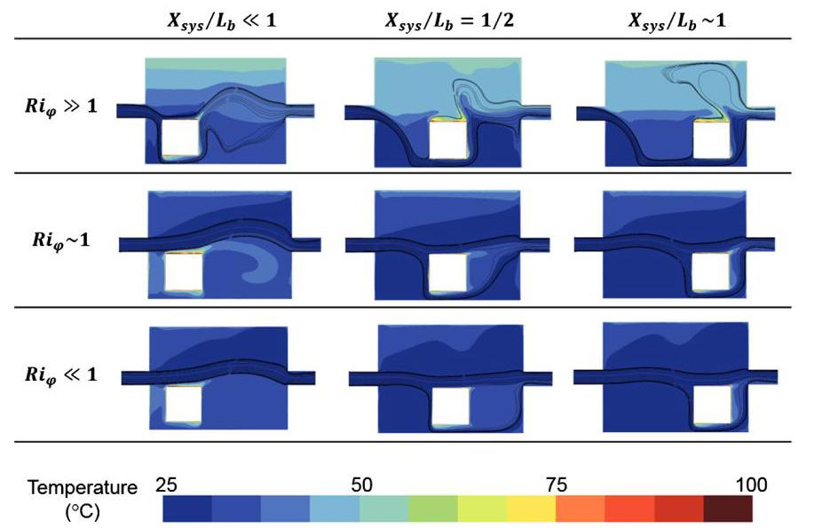

Fig. 8. CFD simulation results when the system is located below the inlet and outlet: ${Y}_{sys}/{Y}_{in} < 1,{Y}_{sys}/{Y}_{out} < 1$ - temperature field and streamlines in black lines.

### 2.4. System integration considerations

#### 2.4.1. Systems and openings locations

The systems' and openings' locations play an important role in the ventilation flow pattern within the bay and the probability of having hot spots. The relative location of the system according to the inlet and outlet is as important during the system integration phase as during the aircraft conceptual design. Critical systems and components must be in ventilated areas even for configuration with natural ventilation. The approach consists of using the geometrical ratios derived from the geometrical parameters to evaluate the relative locations of the system according to the bay and the openings (inlet and outlet). Table 5 introduces the potential geometrical ratios that define the geometrical configuration of the studied problem. Using these geometrical ratios, it is possible to predict if a system is aligned with the inlet or the outlet, and to have a metric representing the location of the system in the bay.

Some of the configurations of the simple case study are used to illustrate the relation between the system location and its environment for different types of ventilation. Fig. 8 shows the CFD simulation results when the system is located below the inlet and outlet, that is to say when the geometrical ratios ${Y}_{sys}/{Y}_{\text{ in }}$ and ${Y}_{sys}/{Y}_{\text{ out }}$ are smaller than one. The results show that whatever the horizontal location of the system and the ventilation type, the temperature distribution stays between the top and bottom temperature,30 and ${50}^{ \circ  }\mathrm{C}$ , respectively; moreover, the system’s heat loads are mixed in the bay or efficiently extracted out of it. Fig. 9 shows the CFD simulation results when the system is horizontally aligned with the inlet and outlet, that is to say when the geometrical ratios ${Y}_{sys}/{Y}_{in}$ and ${Y}_{sys}/{Y}_{\text{ out }}$ are close to one. Here, the temperature distribution is different for the different ventilation types, especially when the system is far from the inlet, when the geometrical ratio ${X}_{sys}/{L}_{b}$ is close to one. For the natural ventilation cases $\left( {R{i}_{\varphi } \gg  1}\right)$ , the bay is highly stratified, and its upper part is hotter than the top wall temperature due to the heat loads generated by the system. Indeed, the inlet flow is not strong enough to mix the bay volume or to extract the heat of the system through the outlet. Moreover, the behaviour is the same for mixed ventilation cases $\left( {R{i}_{\varphi } \sim  1}\right)$ , except when the system is located close to the inlet, on the mainstream flow. However, for the forced ventilation cases $\left( {R{i}_{\varphi } \ll  1}\right)$ , the inlet flow is stronger and can reach the system since it is located on the mainstream flow. In addition, the bay is slightly stratified in this case. The last configurations deal with the system located above the inlet and outlet, which means when the geometrical ratios ${Y}_{sys}/{Y}_{in}$ and ${Y}_{sys}/{Y}_{\text{ out }}$ are higher than one (Fig. 10). The temperature distributions are similar for the natural and mixed ventilation configurations. The system is located just above the inlet, not on the mainstream flow, and the inlet flow is not mixing the bay air. The upper part of the bay reaches high temperatures due to the system heat loads. For the forced ventilation case, the inlet flow is stronger but since the system is not in the mainstream flow, the upper part of the bay is still hot even if a small portion of the heat load seems to be extracted.

In summary, the different configurations of this simple case study highlight the importance of the combination of the system location and ventilation type to assess, in a qualitative manner, the thermal environment of the system. Even if the ventilation type seems not to be favourable, a good system location might be enough to ensure a safe thermal environment.

#### 2.4.2. Thermal interactions with the environment and the other systems

In the previous section, the simple case study highlighted most of the elements to be considered in a thermal risk prediction. However, real equipment bays involve more than one system and all the interactions between the systems and the environment have to be considered, too. This section deals with the approach followed to quantify the thermal interactions between a system and its environment, which is composed of the fuselage walls and the other systems.

The systems interact with the fuselage walls through the form of heat radiation. The radiative heat exchange between a system and the fuselage walls depends on the emissivity of the surfaces $\left( {{\varepsilon }_{sys},{\varepsilon }_{tw}}\right.$ and $\left. {\varepsilon }_{bw}\right)$ , the system’ skin temperature $\left( {T}_{sys}\right)$ , the wall’s temperature $\left( {T}_{tw}\right.$ or $\left. {T}_{bw}\right)$ , and the heat exchange areas $\left( {{A}_{sys},{A}_{tw}}\right.$ and ${A}_{bw}$ ) and the view factor of the system with the considered wall $\left( {{F}_{{sys} - {tw}}\text{ or }{F}_{{sys} - {bw}}}\right)$ .

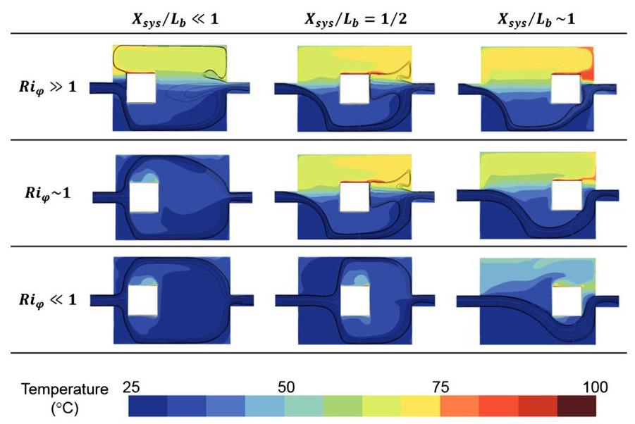

Fig. 9. CFD simulation results when the system is horizontally aligned with the inlet and outlet: ${Y}_{sys}/{Y}_{in} \sim  1,{Y}_{sys}/{Y}_{out} \sim  1$ - temperature field and streamlines in black lines.

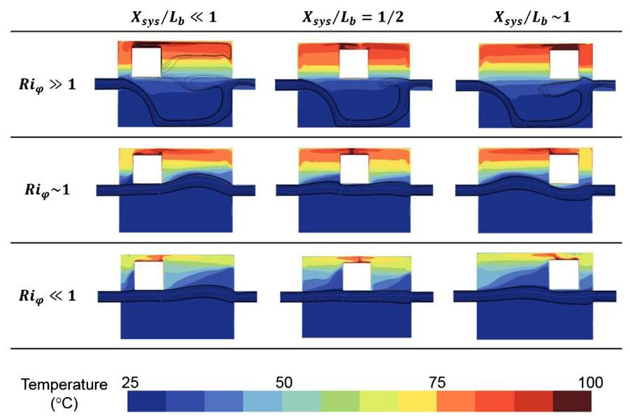

Fig. 10. CFD simulation results when the system is located above the inlet and outlet: ${Y}_{sys}/{Y}_{in} > 1,{Y}_{sys}/{Y}_{out} > 1$ - temperature field and streamlines in black lines.

Here, the wall's temperatures and all the heat exchange areas are part of the input parameters while the view factor of the systems must be estimated to quantify the radiative heat exchange for a specific configuration. The view factor is defined as the proportion of the radiation which leaves the system heat exchange area that is intercepted by the considered wall surface [29]. It can be considered as the link between the system' skin temperature with the walls' temperatures. Thus, the view factors can be used as a metric to quantify the radiative interaction of a system with a fuselage wall within the thermal risk prediction approach. The system's view factors can be easily estimated using the Hottel crossed string method described in [31] or using the literature that provides a large list of analytical expressions for several geometrical configurations [32]. Depending on the wall's temperatures, higher or lower than the system temperature limit (discussed in the next section), the thermal interactions with the fuselage walls can increase or decrease the system skin temperature respectively. For this reason, the heat radiative exchanges are considered inly when the fuselage wall temperatures are higher than the temperature limit of the system under study.

The systems can also have thermal interactions between each other. They can interact through the form of heat radiations as it is the case with the fuselage walls, but they also can interact with the ventilation of the bay under study and more specifically with the inlet flow in the case of forced ventilation. Fig. 11 introduces an example of a situation where two systems are aligned with an inlet flow but a system is located behind the other one. In that case, the second system cannot be cooled by the inlet flow with the same efficiency and it must be considered in the risk prediction.

In this paper, the authors proposed to use the relative locations of the systems with regards to the inlets (refer to section 2.4.1) to rank the systems according to their distance from the source of the inlet flow(s) and along the direction of the flow (usually normal to the inlet cross-sectional area). For example, in Fig. 11 it leads to compare the horizontal location of the systems $\left( {{X}_{sys}{}_{1},{X}_{sys}{}_{2}}\right)$ . Here, the thermal risk prediction of the system 2 will consider that the system is located after the system 1 which is facing the inlet flow.

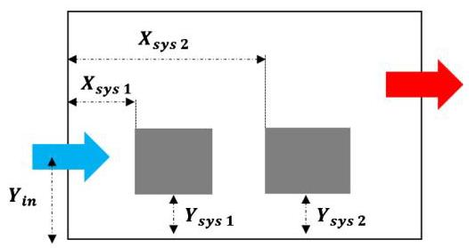

Fig. 11. Example of a multi-systems configuration.

Table 6

Example of the temperature ratios used within the thermal risk assessment.

<table><tr><td>Related entity</td><td>Inlet flow(s)</td><td>Fuselage skin</td><td>Environment</td></tr><tr><td>Ratio</td><td>$\frac{{T}_{\text{ in }}}{{T}_{\text{ lim }}}$</td><td>$\frac{{T}_{bw}}{{T}_{lim}}$ or $\frac{{T}_{tw}}{{T}_{lim}}$</td><td>$\frac{{T}_{\text{ env }}}{{T}_{\text{ lim }}}$</td></tr></table>

The thermal interactions between the systems through the form of heat radiations are more complex to estimate since they depend on the system' skin temperatures, which are unknown. The view factors can be used to evaluate the proportion of radiative heat exchanges between the systems. However, without the skin temperature values it is impossible to know in which direction the exchange takes place. In the scope of this paper, this radiative interaction between the systems is not considered but it merits to be addressed as an independent topic in a future contribution.

#### 2.4.3. System requirements and admissible temperatures

This last section deals with integrating the system requirements into the thermal risk assessment. Generally, the aircraft systems and components are designed, tested and certified following several standards such as RTCA DO-160 [27] or SAE AIR1168/6A [28]. The manufacturer datasheets can also provide the maximum temperature admissible by the system or component. The comparison between the temperature limit specified by the standard with the temperatures of the inlet(s), the top and bottom portion of the fuselage skin of the considered aircraft zone and the ambient temperature provides the environmental and boundary conditions that must be considered during the thermal risk assessment of the considered aircraft zone and systems. For example, in the case of forced ventilation from the inlet flows, if the inlet temperature is close to the temperature limit specified by the standard, the expected thermal risk would be higher than if the inlet temperature is very low compared to the temperature limit specified by the standard. Following the DN approach, the temperature ratios between the maximum admissible temperatures and the temperatures of the inlet(s), the fuselage skin and the ambient temperature are used to assess the system thermal requirements (Table 6).

### 2.5. Thermal risk assessment

##### 2.5.1.The penalty point-based approach

This subsection describes how the different analysis of the thermal risk assessment workflow are combined to predict the thermal risk. As each dimensionless number or factor is used independently, a penalty point-based approach is proposed. It consists of associating points to every output of the analyses by giving fewer points to the ones related to favourable configurations (low thermal risk) and more points to the ones related to non-favourable configurations (high thermal risk). This type of approach has been used for environment thermal risk assessment for workers [33]. In the beginning of this paper (section 1), the thermal risk is defined as the potential of non-compliance with thermal requirements Usually, a risk analysis consists in the assessment of the likelihood and the impact of a situation. In this paper, it is assumed that the impact of the predicted risk on the considered system or architecture is considered as high. Thus, the proposed methodology enables assessing the likelihood of a configuration while considering that all the systems have a high impact. Furthermore, the criticality of the system is not considered within the scope of the paper. The predicted risk must be used as a guide to define requirements or to make decisions during the design procedure and with regard to the criticality of the studied system.

#### 2.5.2. Approach for the thermal risk score calculation

Table 7 introduces the thermal risk score table and the proposed scale. This assessment table is implemented in a Python computing environment to ease its integration and connection with other conceptual design tools in MDO frameworks.

The thermal risk score is a function of five thermal risk factors that follows a conditional multiplication process based on a specific scoring procedure illustrated by Fig. 12 and described by the next paragraph.

The scoring procedure starts with the ventilation analysis (Step 1, ${\mathrm{{TR}}}_{1}$ ). If a forced ventilation prevails, the stratification analysis (Step 2) should not be considered. On the other hand, if the mixed or natural ventilation have been identified, the next step is the stratification analysis (Step 2, ${\mathrm{{TR}}}_{2}$ ). Then, for the forced ventilation cases, the next step assesses relative system location with regards to the inlets and outlets (Step 3.1, ${\mathrm{{TR}}}_{3.1}$ ). If the system is not aligned with an inlet or an outlet, the relative system location must be assessed (Step 3.2, ${\mathrm{{TR}}}_{3.2}$ ). This should also be done for the mixed and natural ventilation cases (Step 3.3, ${\mathrm{{TR}}}_{3.2}$ ). For configurations that involve a forced ventilation with a system aligned with an inlet or an outlet, the temperature limit of the systems must be compared with the inlet(s) and the environment ones (Step 4.1, ${\mathrm{{TR}}}_{4.1}$ and ${\mathrm{{TR}}}_{4.3}$ ). Then, the systems should be ranked according to their relative locations with regards to the inlet flows (Step 5.1, ${\mathrm{{TR}}}_{5.1}$ ). For all the other configurations, such as forced ventilation with a system not aligned with an inlet or an outlet and all the mixed and natural ventilation cases, the temperature limit of the systems must be compared with the fuselage walls and the environment ones (Step 4.2, ${\mathrm{{TR}}}_{4.2}$ and ${\mathrm{{TR}}}_{4.3}$ ). Then, the system view factors should be calculated to estimate their radiative heat exchanges with the fuselage walls only if the walls temperatures exceed the system's temperature limit (Step 5.2, ${\mathrm{{TR}}}_{5.2}$ ). In addition, for the forced ventilation cases with a system not aligned with an inlet or an outlet, the systems should be ranked according to their relative locations with regards to the inlet flows (Step 5.3, TR5.1). Finally, the thermal risk score can be calculated by multiplying all the thermal risk score (TR) involved in the path followed since the step 1.

The next section illustrates the application of the thermal risk assessment approach on two real equipment bays, which were used to set and validate the proposed table score.

## 3. Application and validation on two real equipment bays

This section of the paper discusses the application of the proposed thermal risk assessment approach to the nose equipment bay of a rotorcraft and to the aft-equipment bay (AEB) of an aircraft. These equipment bays are composed of several systems and components (avionics, hydraulic, electrical, ... ), making these bays ideal for a validation example. The validation is done by comparing the CFD simulation results with the prediction obtained by the DN-based approach. The ratios between the averaged system skin temperatures or the system's temperature with the temperature limits are used to define the thermal risk. The authors define the medium risk as the $\pm  5\%$ range around the temperature limit of the system under study. The thermal medium risk defines situations where a more detailed analysis is required to validate the thermal integration of the system under study. Thus, the thermal risk ranges used for these case studies are:

Table 7

Thermal risk assessment score attribution.

<table><tr><td>Thermal risk assessment parameter</td><td>Score</td><td>Thermal risk assessment parameter</td><td>Score</td></tr><tr><td>Ventilation analysis</td><td>${\mathrm{{TR}}}_{1}$</td><td>Temperature stratification analysis</td><td>${\mathrm{{TR}}}_{2}$</td></tr><tr><td>Natural convection: $R{i}_{\varphi } \gg  1$</td><td>3</td><td>Unstable thermal gradient: ${R}_{\text{ nat }} \leq  1$</td><td>3</td></tr><tr><td>Mixed convection: $R{i}_{\varphi } \sim  1$</td><td>2</td><td>Unstable thermal gradient: ${R}_{\text{ nat }} > 1$</td><td>2</td></tr><tr><td>Forced convection: $R{i}_{\varphi } \ll  1$</td><td>1</td><td>Stable thermal gradient</td><td>1</td></tr><tr><td>Location in the zone</td><td>${\mathrm{{TR}}}_{3}$</td><td>Temperature limits</td><td>${\mathrm{{TR}}}_{4}$</td></tr><tr><td>Relative to ...</td><td>${\mathrm{{TR}}}_{3.1}$</td><td>Relative to an inlet</td><td>${\mathrm{{TR}}}_{4.1}$</td></tr><tr><td>...an inlet Not aligned: ${Y}_{sys}/{Y}_{in} \neq  1$ or ${X}_{sys}/{X}_{in} \neq  1$ or ${Z}_{sys}/{Z}_{in} \neq  1$</td><td>2</td><td>Hot inlet: ${T}_{\text{ in }}/{T}_{\text{ lim }} \geq  1$   Cold inlet: ${T}_{\text{ in }}/{T}_{\text{ lim }} < 1$</td><td>2   1</td></tr><tr><td>Aligned: ${Y}_{sys}/{Y}_{in} \sim  1$ or ${X}_{sys}/{X}_{in} \sim  1$</td><td>1</td><td>Relative to the bay</td><td>TR4.2</td></tr><tr><td>${Z}_{sys}/{Z}_{in} \neq  1$</td><td></td><td>Hot bottom wall: ${T}_{bw}/{T}_{lim} > 1$</td><td>2</td></tr><tr><td>...an outlet Not aligned: ${Y}_{sys}/{Y}_{\text{ out }} \neq  1$ or ${X}_{sys}/{X}_{\text{ out }} \neq  1 \; {Z}_{sys}/{Z}_{\text{ out }} \sim  1$</td><td>2</td><td>Hot top wall: ${T}_{tw}/{T}_{lim} > 1$   Cold bottom wall: ${T}_{bw}/{T}_{lim} < 1$</td><td>1</td></tr><tr><td>Aligned: ${Y}_{sys}/{Y}_{\text{ out }} \sim  1$ or ${X}_{sys}/{X}_{\text{ out }} \sim  1 \; {Z}_{sys}/{Z}_{\text{ out }} \sim  1$</td><td>1</td><td>Cold top wall: ${T}_{tw}/{T}_{lim} < 1$</td><td></td></tr><tr><td>Relative to the bay</td><td>${\mathrm{{TR}}}_{3.2}$</td><td>Relative to the environment</td><td>TR4.3</td></tr><tr><td>Top of the bay: ${Y}_{sys}/{H}_{b} \sim  1$</td><td>3</td><td>Hot environment: ${T}_{\text{ env }}/{T}_{\text{ lim }} > 1$</td><td>3</td></tr><tr><td>Middle of the bay: ${Y}_{sys}/{H}_{b} \sim  {0.5}$</td><td>2</td><td>Warm environment: ${T}_{env}/{T}_{lim} \sim  1$</td><td>2</td></tr><tr><td>Bottom of the bay: ${Y}_{sys}/{H}_{b} \ll  1$ :</td><td>1</td><td>Cold environment: ${T}_{\text{ env }}/{T}_{\text{ lim }} < 1$</td><td>1</td></tr><tr><td colspan="4">Thermal interactions ${\mathrm{{TR}}}_{5}$</td></tr><tr><td>System to system flow interactions</td><td>${\mathrm{{TR}}}_{5.1}$</td><td>Wall to system radiations (only if ${\mathrm{{TR}}}_{4.2} > 1$ )</td><td>TR5.1</td></tr><tr><td>System located after other system(s) in the flow direction</td><td>2</td><td>${F}_{{sys} - {tw}} \geq  {0.5}$   ${F}_{{sys} - {bw}} \geq  {0.5}$</td><td>2</td></tr><tr><td rowspan="2">First system in the flow direction: $\min \left( {{Y}_{sys}/{Y}_{in}}\right)$ or $\min \left( {{X}_{sys}/{X}_{in}}\right)$ or $\min \left( {{Z}_{sys}/{Z}_{in}}\right)$</td><td>1</td><td>${F}_{{sys} - {tw}} < {0.5}$</td><td>1</td></tr><tr><td></td><td>${F}_{{sys} - {bw}} < {0.5}$</td><td></td></tr><tr><td>Total thermal risk score</td><td></td><td>$T{R}_{tot} = f\left( {T{R}_{1}, T{R}_{2}, T{R}_{3}, T{R}_{4}, T{R}_{5}}\right)$</td><td></td></tr><tr><td>Low risk</td><td></td><td>$T{R}_{tot} < 5$</td><td></td></tr><tr><td>Medium risk</td><td></td><td>$5 \leq  T{R}_{tot} \leq  {10}$</td><td></td></tr><tr><td>High risk</td><td></td><td>$T{R}_{tot} > {10}$</td><td></td></tr></table>

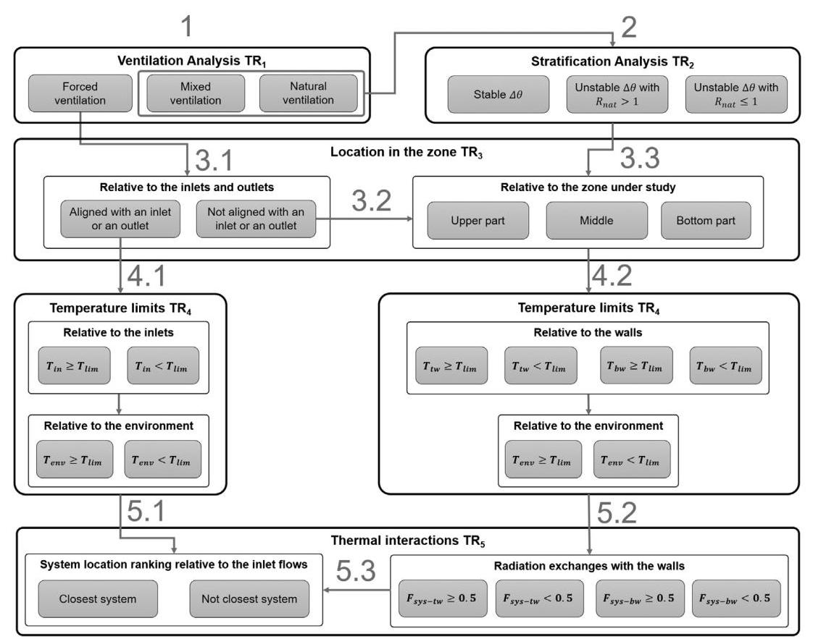

Fig. 12. Flowchart for the thermal risk scoring procedure.

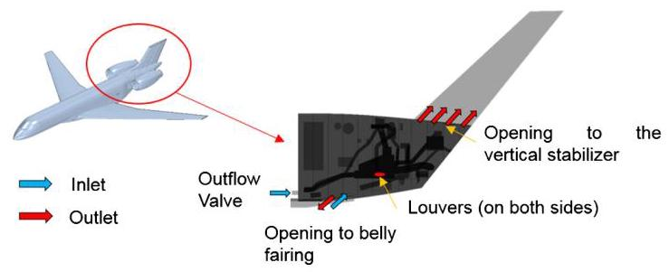

Fig. 13. Aft Equipment Bay (AEB) of an aircraft and potential ventilation configuration.

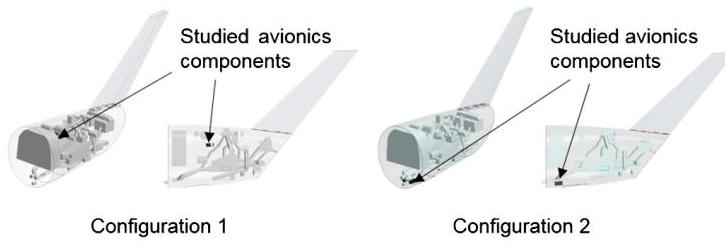

Fig. 14. Studied configurations of the considered avionics components in the aircraft AEB.

- Low risk: ${T}_{sys} < {0.95}{T}_{lim}$ ;

- Medium risk: ${0.95}{T}_{\text{ lim }} \lesssim  {T}_{\text{ sys }} \lesssim  {1.05}{T}_{\text{ lim }}$ ;

- High risk: ${T}_{sys} > {1.05}{T}_{\text{ lim }}$ .

3.1. Case study 1: business aircraft equipment bay (AEB)

Fig. 13 depicts the AEB under investigation and the ventilation configuration analysed. This AEB, representative of a modern large business jet with rear-mounted engines, houses several aircraft systems and components, such as the pneumatic system, the hydraulic system and several avionics components. The AEB receives ventilation through the outflow valve and connection to the aircraft belly fairing. The flow through the outflow valve is an extraction of the environmental control system (ECS) flow.

Within the AEB, some of the avionics components are critical Fly-by-Wire components that require a safe thermal environment. This case study focuses on the placement of two avionics components (placed side-by-side). Generally, during the conceptual design phase, the component location is driven by routing and maintenance access criteria; the thermal environment being investigated later in the design process. Here, it is proposed to use the thermal risk assessment approach to consider an additional criterion to drive the avionics component integration analysis during conceptual design. To illustrate the approach, two potential locations of the components are considered (Fig. 14). Configuration 1 minimizes the wire routing, as the studied avionics are located close to other avionics components. Configuration 2 eases the maintenance access, as the studied avionics are located in the bottom part of the bay close to the access panel.

For the thermal assessment, two operating cases are considered for hot day conditions during a ground operation with the aircraft parked. The first operating case assumes closed passenger doors. In this case, the AEB inlet flow through the outflow valve ${M}_{flow}$ consists of the bulk of the ECS flow. The second operating case assumes the passenger doors are open. In this case, a large proportion of the ECS flow leaves the aircraft through the doors, and only a portion of the ECS flow is extracted through the outflow valve. Thus, the inlet mass flow rate for the studied AEB becomes very small compared to the first case. Table 8 gives the inputs data used for the two configurations under study.

Table 8

Boundary conditions for the aircraft AEB case study.

<table><tr><td></td><td>Passenger doors closed</td><td>Passenger doors open</td></tr><tr><td>Inlet ${M}_{\text{ flow }}$</td><td>0.1 kg/s</td><td>0.3 kg/s</td></tr><tr><td>Tenv</td><td>55 C</td><td></td></tr><tr><td>${T}_{\text{ in }}$</td><td>50 C</td><td></td></tr><tr><td>${T}_{tw}$</td><td>90 C</td><td></td></tr><tr><td>${T}_{bw}$</td><td>55 C</td><td></td></tr><tr><td>${T}_{lim}$</td><td>70 C</td><td></td></tr><tr><td>Total system heat loads</td><td>6000 W</td><td></td></tr></table>

#### 3.1.1. Prediction of the thermal risk

This subsection consists of applying the thermal risk assessment approach to the AEB for two different operating cases. Table 9 and Table 10 provide an overview of the thermal risk analyses and prediction respectively for all the configurations. The following observations can be made. First, the predicted thermal risks for Configuration 1 are lower than for Configuration 2 for both considered operating cases. Secondly, Configuration 1 has the potential to satisfy the components certification requirements as a low thermal risk is predicted for both operating cases. On the other hand, Configuration 2 involves a higher risk due to the location of the avionics in the AEB for the two operating cases. Thus, configuration 2 may not satisfy the components certification requirement. The next subsection presents the CFD simulation results for all the configurations to validate the thermal risk predictions.

#### 3.1.2. Comparison with CFD simulations

CFD simulations have been conducted for configurations 1 and 2 using the commercial software Star-CCM+. The CFD model has the following characteristics:

- Incompressible and ideal gas has been considered;

- Gravity and internal radiation effect have been considered;

- Coupled flow-energy solver with SST k- $\omega$ turbulence model;

- The mesh deals with 6 million of cells. Polyhedral elements are used for the volume mesh and a prims layer mesher is used for the boundary layers on the walls.

Fig. 15 and Fig. 16 give the results obtained for Configuration 1 and Configuration 2 respectively. For configuration 1, the CFD results shows that the avionics ambient temperature is close (Medium risk) and exceeds (High risk) the considered temperature limit when the passenger door is closed and opened respectively. The thermal risk predictions are high for both cases. The results obtained for Configuration 2 are in accordance with the predicted thermal risks, low risk for both cases since the temperature of the avionics environment is below the temperature limit considered for this case study. Out of these two configurations, only one configuration was overpredicted (High instead of medium risk) by the proposed approach. However, this discrepancy represents a pitfall of the medium risk range definition ( $\pm  5\%$ around ${T}_{lim}$ ) that is used to the convert CFD results into thermal risks. It would be worth to conduct a more intensive validation exercise against CFD simulation results in order to refine the medium risk range and avoid this pitfall for future thermal risk predictions.

Finally, the CFD results confirm the thermal risk prediction outcomes, which shows that for the same ventilation configuration, the location of a component within an equipment bay plays an important role regarding its thermal environment.

Table 9

Thermal risk analysis results for the aircraft AEB case study.

<table><tr><td rowspan="2">Config.</td><td colspan="2">Ventilation analysis</td><td colspan="2">Stratification analysis</td><td colspan="2">Location in the zone</td><td colspan="4">Temperature limits</td><td colspan="2">Thermal interactions</td></tr><tr><td>Factor</td><td>$T{R}_{1}$</td><td>Factor</td><td>$T{R}_{2}$</td><td>Factor</td><td>${\mathrm{{TR}}}_{3}$</td><td>Inlet</td><td>Walls</td><td>Ambient</td><td>$T{R}_{4}$</td><td>Factor</td><td>$T{R}_{5}$</td></tr><tr><td>1 with door closed</td><td>Forced $R{i}_{\varphi } \ll  1$</td><td>1</td><td>-</td><td>-</td><td>Not aligned; Middle of the zone</td><td>8</td><td>-</td><td>${T}_{bw} < {T}_{lim} \; {T}_{tw} > {T}_{lim}$</td><td>${T}_{env} < {T}_{lim}$</td><td>2</td><td>Behind a system</td><td>2</td></tr><tr><td>2 with door closed</td><td></td><td>1</td><td>-</td><td>-</td><td>Aligned with an inlet and outlet</td><td>1</td><td>${T}_{\text{ in }} < {T}_{\text{ lim }}$</td><td>-</td><td>${T}_{env} < {T}_{lim}$</td><td>1</td><td>Closest system</td><td>1</td></tr><tr><td>1 with door open</td><td>Mixed $R{i}_{\varphi } \sim  1$</td><td>2</td><td>Stable ${T}_{tw} > {T}_{bw}$</td><td>1</td><td>Not aligned; Top of the zone</td><td>4</td><td>-</td><td>${T}_{bw} < {T}_{lim} \; {T}_{tw} > {T}_{lim}$</td><td>${T}_{env} < {T}_{lim}$</td><td>2</td><td>${F}_{{sys} - {tw}} > {0.5}$</td><td>2</td></tr><tr><td>2 with door open</td><td></td><td>2</td><td></td><td>1</td><td>Bottom of the zone</td><td>1</td><td>${T}_{\text{ in }} < {T}_{\text{ lim }}$</td><td>${T}_{bw} < {T}_{lim} \; {T}_{tw} > {T}_{lim}$</td><td>${T}_{env} < {T}_{lim}$</td><td>1</td><td>${F}_{{sys} - {tw}} < {0.5}$</td><td>1</td></tr></table>

Table 10

Thermal risk scores and predictions for the aircraft AEB case study.

<table><tr><td>Configuration</td><td colspan="2">1 with door closed</td><td colspan="2">2 with door closed</td><td colspan="2">1 with door open</td><td colspan="2">2 with door open</td></tr><tr><td>Thermal risk</td><td>$T{R}_{tot} = {32}$</td><td>High</td><td>$T{R}_{tot} = 1$</td><td>Low</td><td>$T{R}_{tot} = {32}$</td><td>High</td><td>$T{R}_{tot} = 2$</td><td>Low</td></tr></table>

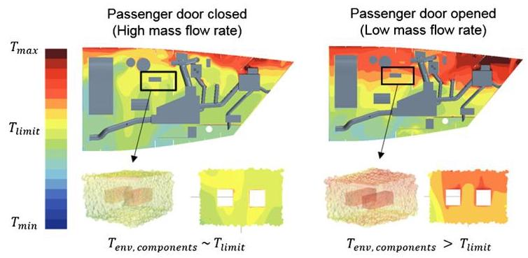

Fig. 15. CFD simulation results for Configuration 1 for the two operating cases (passenger doors closed and open).

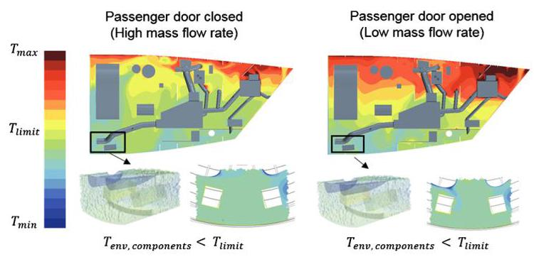

Fig. 16. CFD simulation results for Configuration 2 for the two operating cases (passenger doors closed and open).

### 3.2. Case study 2: rotorcraft nose equipment bay (NEB)

This second case study deals with eleven avionics components located in a nose equipment bay of a rotorcraft (Fig. 1). Akin and Kahveci conducted a CFD-based optimization study to find the best location of the cooling fan and the exhaust to satisfy the system temperature requirements [10].

#### 3.2.1. Prediction of the thermal risk

Here, the thermal risk assessment approach is first applied to the NEB configuration (Fig. 17) based on the inputs data provided in the paper (Table 11). A ground operation with hot day conditions is considered where the fan pulls air from the external environment to cool the eleven avionics equipment. Then, the air leaves the bay through the exhaust hole. The sizes of the bay and the systems, and their temperature limits are extracted from the reference paper to predict the thermal risk.

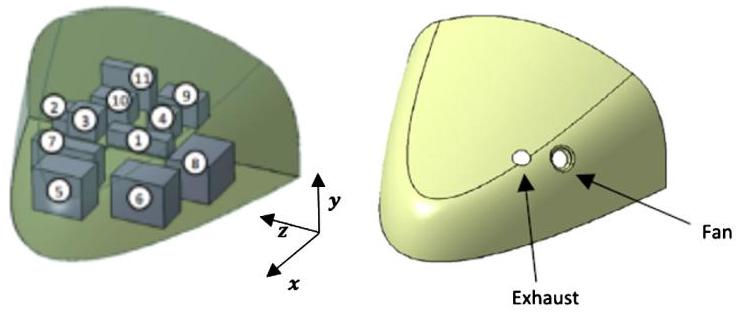

Fig. 17. Rotorcraft NEB configuration: avionics, fan and exhaust locations (from [10]).

Table 11

Inputs data used for the NEB case study.

<table><tr><td>Parameters</td><td>Values</td><td>Avionics</td><td>${T}_{\text{ lim }}$ in ${}^{ \circ  }\mathrm{C}$</td></tr><tr><td>Inlet ${M}_{\text{ flow }}$</td><td>0.0256 kg/s</td><td>1</td><td>87</td></tr><tr><td>Tenv</td><td>50 C</td><td>2</td><td>110</td></tr><tr><td>${T}_{\text{ in }}$</td><td>50 C</td><td>3</td><td>112</td></tr><tr><td>Ttw</td><td>80 C</td><td>4</td><td>112</td></tr><tr><td>Tbw</td><td>60 C</td><td>5</td><td>112</td></tr><tr><td>Total system heat loads</td><td>880 W</td><td>6</td><td>120</td></tr><tr><td>${H}_{b}$</td><td>0.8 m</td><td>7</td><td>118</td></tr><tr><td>${L}_{b}$</td><td>1.1 m</td><td>8</td><td>112</td></tr><tr><td>${W}_{b}$</td><td>1.3 m</td><td>9</td><td>126</td></tr><tr><td>${D}_{fan}$</td><td>0.1 m</td><td>10</td><td>110</td></tr><tr><td></td><td></td><td>11</td><td>91</td></tr></table>

Table 12 gives the different thermal risk analyses for the eleven avionics equipment under study. As the ventilation is predicted as forced, the stratification analysis is not considered. Thus, only the system locations and the temperature limits have an influence on the thermal risk prediction. Furthermore, the fuselage wall temperatures are lower than all the system's temperature limits so only the thermal interactions of the systems with the inlet flows are also considered. Table 13 gives the thermal risk predictions for the eleven avionics components. The avionics 1, 4 and 6 are predicted with a low thermal risk which is the consequence of their location close to the fan inlet. The avionics 2, 5, 7 and 8 are predicted with a medium risk since they are not aligned with an inlet or an outlet and located on the bottom part of the zone. Moreover, the avionics 3 and 10 are predicted with a medium thermal risk. They are aligned with the inlet but they are located behind the system 1 and 4 on the top part of the zone. Finally, the avionics 9 and 11 are predicted as high risk because they are not aligned with the inlet and outlet and located in the top of the zone. The next section compares and discusses these predictions with the CFD simulation results.

Table 12

Thermal risk analysis results for the rotorcraft NEB case study.

<table><tr><td rowspan="2">Avionics</td><td colspan="2">Ventilation analysis</td><td colspan="2">Location in the zone</td><td colspan="4">Temperature limits</td><td colspan="2">Thermal interactions</td></tr><tr><td>Factor</td><td>$T{R}_{1}$</td><td>Factor</td><td>$T{R}_{3}$</td><td>Inlet</td><td>Walls</td><td>Ambient</td><td>$T{R}_{4}$</td><td>Factor</td><td>$T{R}_{5}$</td></tr><tr><td>1</td><td>Forced   $R{i}_{\varphi } \ll  1$</td><td>1</td><td>Aligned with the inlet and outlet</td><td>1</td><td>${T}_{\text{ in }} < {T}_{\text{ lim }}$</td><td>-</td><td>${T}_{env} < {T}_{lim}$</td><td>1</td><td>Facing the flow</td><td>1</td></tr><tr><td>2</td><td></td><td></td><td>Not aligned; Bottom of the zone</td><td>4</td><td>-</td><td>${T}_{bw} < {T}_{lim}$   ${T}_{tw} < {T}_{\lim }$</td><td></td><td>1</td><td>Behind a system</td><td>2</td></tr><tr><td>3</td><td></td><td></td><td>Aligned with the inlet but not with the outlet; Top of the zone</td><td>5</td><td>${T}_{in} < {T}_{lim}$</td><td>${T}_{bw} < {T}_{lim}$   ${T}_{tw} < {T}_{lim}$</td><td></td><td>1</td><td>Behind a system</td><td>2</td></tr><tr><td>4</td><td></td><td></td><td>Aligned with the inlet and outlet</td><td>1</td><td>${T}_{in} < {T}_{lim}$</td><td>-</td><td></td><td>1</td><td>Behind a system</td><td>2</td></tr><tr><td>5</td><td></td><td></td><td>Not aligned; Bottom of the zone</td><td>4</td><td>-</td><td>${T}_{bw} < {T}_{lim}$   ${T}_{tw} < {T}_{lim}$</td><td></td><td>1</td><td>Behind a system</td><td>2</td></tr><tr><td>6</td><td></td><td></td><td>Aligned with the inlet and outlet</td><td>1</td><td>${T}_{\text{ in }} < {T}_{\text{ lim }}$</td><td>-</td><td></td><td>1</td><td>Facing the flow</td><td>1</td></tr><tr><td>7</td><td></td><td></td><td>Not aligned; Bottom of the zone</td><td>4</td><td>-</td><td>${T}_{bw} < {T}_{lim}$   ${T}_{tw} < {T}_{lim}$</td><td></td><td>1</td><td>Behind a system</td><td>2</td></tr><tr><td>8</td><td></td><td></td><td>Not aligned; Bottom of the zone</td><td>4</td><td>-</td><td>${T}_{bw} < {T}_{lim}$   ${T}_{tw} < {T}_{lim}$</td><td></td><td>1</td><td>Behind a system</td><td>2</td></tr><tr><td>9</td><td></td><td></td><td>Not aligned; Top of the zone</td><td>12</td><td>-</td><td>${T}_{bw} < {T}_{lim}$   ${T}_{tw} < {T}_{lim}$</td><td></td><td>1</td><td>Behind a system</td><td>2</td></tr><tr><td>10</td><td></td><td></td><td>Aligned with the inlet but not with the   outlet; Top of the zone</td><td>5</td><td>-</td><td>${T}_{bw} < {T}_{lim}$   ${T}_{tw} < {T}_{lim}$</td><td></td><td>1</td><td>Behind a system</td><td>2</td></tr><tr><td>11</td><td></td><td></td><td>Not aligned; Top of the</td><td>12</td><td>-</td><td>${T}_{bw} < {T}_{lim}$</td><td></td><td>1</td><td>Behind</td><td>2</td></tr><tr><td></td><td></td><td></td><td>zone</td><td></td><td></td><td>${T}_{tw} < {T}_{lim}$</td><td></td><td></td><td>a system</td><td></td></tr></table>

Table 13

Thermal risk scores and predictions for the rotorcraft NEB case study.

<table><tr><td>Avionics</td><td>1</td><td>2</td><td>3</td><td>4</td><td>5</td><td>6</td></tr><tr><td>Thermal risk score $T{R}_{tot}$   Risk prediction</td><td>1   Low</td><td>8   Medium</td><td>10   Medium</td><td>2   Low</td><td>8   Medium</td><td>1   Low</td></tr><tr><td>Avionics</td><td>7</td><td>8</td><td>9</td><td>10</td><td>11</td><td></td></tr><tr><td>Thermal risk score $T{R}_{tot}$</td><td>8</td><td>8</td><td>24</td><td>10</td><td>24</td><td></td></tr><tr><td>Risk prediction</td><td>Medium</td><td>Medium</td><td>High</td><td>Medium</td><td>High</td><td></td></tr></table>

#### 3.2.2. Comparison with CFD simulations

The thermal risk predictions are validated against the avionics averaged surfaced temperatures provided in the reference paper [10]. Table 14 gives the system skin temperatures, the derived thermal risks and the predictions from Table 13. The thermal risk predictions match the CFD results for seven of the avionics components, three avionics are overpredicted (avionics 2, 9, 11) and only one is underpredicted (avionics 6). The cooling of the avionics 1, 9 and 11 is achieved by the recirculation of the inlet flow in the bay as it can be seen in the CFD results (Fig. 18). This represents a limitation of the proposed approach since the scoring associated to the ranking of the systems based on their relative location with regards to the inlet flow (Table 7, $T{R}_{5}$ ) does not consider potential recirculating flows and, thus, it makes the thermal risk prediction higher. On the other hand, the avionics 6 prediction is underestimated with a low thermal risk while the CFD results give a medium thermal risk. From a thermal risk prediction point of view, this component is one of the closest to the inlet and the outlet of the bay under study, so it is expected that it interacts with a large proportion of the air flow. However, its skin temperature predicted by the CFD simulation $\left( {{T}_{skin} = {118}^{ \circ  }\mathrm{C}}\right)$ is really close to its limit $\left( {{T}_{\text{ lim }} = {120}^{ \circ  }\mathrm{C}}\right)$ , and the gap of $2{}^{ \circ  }\mathrm{C}$ between these temperatures leads to a medium thermal risk according to the range defined previously (±5% around ${T}_{\text{ lim }}$ ). A first solution to avoid this type of underprediction might be a different definition of the medium risk range in order to do not consider the system with a lower temperature than the acceptable limit as a medium risk. However, it calls into question the relevance of the medium risk in the proposed approach. Another solution to overcome such underprediction would be to consider the inlet and the outlet not with the same risk score in the thermal risk prediction approach. When a system is located to an inlet or an outlet, on one hand, it receives a large proportion of the flow while on the other hand the temperature of the inlet flow is colder than the temperature of the flow extracted through the outlet. Indeed, the flow extracted through the outlet has been heated by the systems that interact with the inlet flow and the temperature at the outlet location is higher than at the inlet. In this case study, this would explain why the avionics 6 skin temperature is close to the temperature limit as it is located close the outlet of the bay. Future improvements of the methodology will deal with a different scoring for the systems located close to an outlet.

## 4. Conclusion

This paper introduces an innovative approach for predicting the thermal risk associated with the system architecture for aircraft equipment bays. This methodology, suitable for conceptual design, uses a combination of dimensionless numbers and provides a step-by-step process to predict potential non-compliance with the system thermal requirements earlier during the design process.

Table 14

Comparison between the CFD results and the thermal risk predictions for the rotorcraft NEB case study.

<table><tr><td>Avionics</td><td>1</td><td>2</td><td>3</td><td>4</td><td>5</td><td>6</td></tr><tr><td>Surface averaged temperature in ${}^{ \circ  }\mathrm{C}$</td><td>80</td><td>100</td><td>117</td><td>97</td><td>112</td><td>118</td></tr><tr><td>Thermal risk based CFD</td><td>Low</td><td>Low</td><td>Medium</td><td>Low</td><td>Medium</td><td>Medium</td></tr><tr><td>Thermal risk Prediction</td><td>Low</td><td>Medium</td><td>Medium</td><td>Low</td><td>Medium</td><td>Low</td></tr><tr><td>Avionics</td><td>7</td><td>8</td><td>9</td><td>10</td><td>11</td><td></td></tr><tr><td>Surface averaged temperature in ${}^{ \circ  }\mathrm{C}$</td><td>118</td><td>102</td><td>117</td><td>109</td><td>95</td><td></td></tr><tr><td>Thermal risk based CFD</td><td>Medium</td><td>Medium</td><td>Low</td><td>Medium</td><td>Medium</td><td></td></tr><tr><td>Thermal risk Prediction</td><td>Medium</td><td>Medium</td><td>High</td><td>Medium</td><td>High</td><td></td></tr></table>

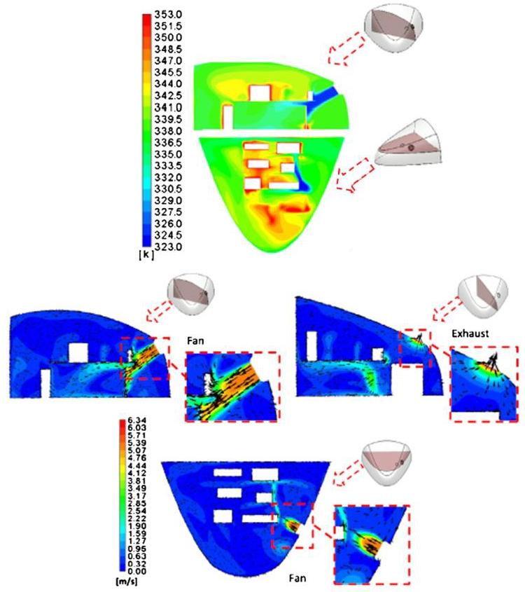

Fig. 18. CFD results for NEB case study: temperature fields on top and velocity contours on bottom (extracted from [10]).

The application of such thermal design capability on two representative case studies has shown its benefits from a conceptual design point of view. In addition, these case studies provided a detailed overview of how the proposed workflow is used to predict the thermal risk of a specific configuration and for several aircraft systems and components. The authors propose a penalty-point based approach to calculate the thermal risk score and three ranges are defined for low, medium and high risks. This thermal assessment is implemented in a Python environment that will allow its integration into MDO frameworks in the future. The comparison of the thermal risk predictions with CFD simulation results demonstrates the consistency of the proposed approach for different equipment bay configuration and for different operating cases. In addition, the case studies also highlighted some limitations related the consideration of complex ventilation flow pattern in an equipment bay or the thermal interactions between the systems. However, the thermal risk predictions are conservatives and several potential improvements are discussed to enhance the accuracy of the proposed approach. Future work will deal with the development of dimensionless numbers to predict the system interactions with the flow and the radiative heat exchanges between the systems.

Finally, within the current context of more electrical, hybrid and all electrical aerospace vehicles, the thermal management of the aircraft system architectures is becoming more important and this novel thermal analysis capability will assist the definition of system thermal requirements. Furthermore, it will help to handle the increase of on-board system heat loads by detecting the risk of potential thermal issues during the aircraft conceptual design phase. Thus, the definition of aircraft system architectures will consider thermal requirements and the integration of novel technology will be more efficient and safer.

## Declaration of competing interest

The authors declare that they have no known competing financial interests or personal relationships that could have appeared to influence the work reported in this paper.

## Acknowledgements

The authors thank the Mitacs Elevate program, which supported this research work (grant number: IT09451). The authors thank Yanik Boutin, Sebastien Beaulac and Hongzhi Wang from the Bombardier Aviation for their support and contribution for the business aircraft aft equipment bay case study. The authors acknowledge Abdul Malik Huzaifa for his contribution for the development of the proposed approach.

## References

[1] M.F. Ahlers, Aircraft thermal management, in: Encycl. Aerosp. Eng., 2011, pp. 1-13.

[2] R. Herring, Subsystem thermal integration - a new challenge to the aircraft designer, in: Aircr. Des. Syst. Oper. Conf, American Institute of Aeronautics and Astronautics, Reston, Virigina, 1990.

[3] B.J. Brelje, J.R.R.A. Martins, Electric, hybrid, and turboelectric fixed-wing aircraft: a review of concepts, models, and design approaches, Prog. Aerosp. Sci. 104 (2019) 1-19, https://doi.org/10.1016/j.paerosci.2018.06.004.

[4] C.P. Lawson, J.M. Pointon, Thermal management of electromechanical actuation on an all-electric aircraft, in: ICAS Secr. - 26th Congr. Int. Counc. Aeronaut. Sci. 2008, ICAS 2008, vol. 4, 2008, pp. 1467-1477.

[5] J.M. Rheaume, C.E. Lentsii, Design and simulation of a commercial hybrid electric aircraft thermal management system, in: 2018 AIAA/IEEE Electr. Aircr. Technol. Symp., EATS 2018, 2018, pp. 1-9.

[6] B.T. Schiltgen, J.L. Freeman, D.W. Hall, Aeropropulsive interaction and thermal system integration within the ECO-150: a turboelectric distributed propulsion airliner with conventional electric machines, in: 16th AIAA Aviat. Technol. In-tegr. Oper. Conf., 2016, pp. 1-18.

[7] European Commission FP7 Maaximus, 2009.

[8] P. Arbez, TOICA Final Report - Publishable Summary, 2013.

[9] C. Butler, D. Newport, M. Geron, Optimising the locations of thermally sensitive equipment in an aircraft crown compartment, Aerosp. Sci. Technol. 28 (2013) 391-400, https://doi.org/10.1016/j.ast.2012.12.005.

[10] A. Akin, H.S. Kahveci, An optimization study for rotorcraft avionics bay cooling, Aerosp. Sci. Technol. 90 (2019) 1-11, https://doi.org/10.1016/j.ast.2019.04.029.

[11] F. Sanchez, S. Liscouet-Hanke, Y. Boutin, S. Beaulac, A thermal risk assessment approach for the conceptual design of aircraft system architectures, in: AIAA Aviat. 2019 Forum, American Institute of Aeronautics and Astronautics, Reston, Virginia, 2019.

[12] E. Buckingham, On physically similar systems: illustration of the use of dimensional equations, Phys. Rev. 4 (1914) 345-376.

[13] I.I. Nosonov, M.A. Sheremet, Conjugate mixed convection in a rectangular cavity with a local heater, Int. J. Mech. Sci. 136 (2018) 243-251, https://doi.org/10.1016/j.ijmecsci.2017.12.049.

[14] G.P. Huang, D.B. Doman, M.J. Rothenberger, B. Hencey, M.P. DeSimio, A. Tipton, D.O. Sigthorsson, Dimensional analysis, modeling, and experimental validation of an aircraft fuel thermal management system, J. Thermophys. Heat Transf. 33 (2019) 983-993, https://doi.org/10.2514/1.T5660.

[15] W.M.B. Duval, R. Balasubramaniam, Convection effects on thermal stratification inside enclosures due to wall heat flux, in: 46th AIAA Aerosp. Sci. Meet. Exhib., 2008, pp. 1-22.

[16] A. Castell, M. Medrano, C. Solé, L.F. Cabeza, Dimensionless numbers used to characterize stratification in water tanks for discharging at low flow rates, Renew. Energy 35 (2010) 2192-2199, https://doi.org/10.1016/j.renene.2010.03.020.

[17] H. Gunes, S. Cadirci, K. Gocmen, Numerical simulation of mixed convection in a rectangular cavity with multiple heat sources, in: Vol. 9: Heat Transf. Fluid Flows, Therm. Syst. Parts A, B and C, ASME, 2009, pp. 1335-1344.

[18] É. Fontana, C.A. Capeletto, A. Da Silva, V.C. Mariani, Numerical analysis of mixed convection in partially open cavities heated from below, Int. J. Heat Mass Transf. 81 (2015) 829-845, https://doi.org/10.1016/j.ijheatmasstransfer.2014.11.011.

[19] E. Papanicolaou, Y. Jaluria, Mixed convection from simulated electronic components at varying relative positions in a cavity, J. Heat Transf. 116 (1994) 960, https://doi.org/10.1115/1.2911472.

[20] Dassault systèmes, CATIA (V5R21), https://www.3ds.com/products-services/ catia/, 2020.

[21] PTC, Pro/Engineer, https://www.ptc.com/en/products/cad/pro-engineer, 2020.

[22] NASA, OpenVSP, https://software.nasa.gov/featuredsoftware/openvsp, 2020.

[23] S.K. Banerjee, P. Thomas, X. Cai, CATIA V5-based parametric aircraft geometry modeler, SAE Int. J. Aerosp. 6 (2013) 311-321, https://doi.org/10.4271/2013-01- 2321.

[24] Aerothermodynamic systems engineering and design, in: AIR1168/3A, SAE International, 2019, p. 117.

[25] J. Díaz, S. Hernández, Uncertainty quantification and robust design of aircraft components under thermal loads, Aerosp. Sci. Technol. 14 (2010) 527-534, https://doi.org/10.1016/j.ast.2010.04.004.

[26] L. Wang, Y. Liu, A novel method of distributed dynamic load identification for aircraft structure considering multi-source uncertainties, Struct. Multidis-cip. Optim. (2020), https://doi.org/10.1007/s00158-019-02448-8.

[27] DO-160, Environmental Conditions and Test Procedures for Airborne Equipment, RTCA (2011).

[28] Characteristics of equipment components, equipment cooling system design, and temperature control system design, in: AIR1168/6A, SAE International, 2011, p. 226.

[29] F.P. Incropera, D.P. DeWitt, T.L. Bergman, A.S. Lavine, Fundamentals of heat and mass transfer, https://doi.org/10.1073/pnas.0703993104, 2007.

[30] T. Cebeci, P. Bradshaw, Physical and Computational Aspects of Convective Heat Transfer, Springer Berlin Heidelberg, Berlin, Heidelberg, 1984.

[31] W.H. Mc Adams, Heat Transmission, 3rd ed., McGraw-Hill, 1985.

[32] J.R. Howell, A Catalog of Radiation Configuration Factors, McGraw-Hill Book, New York, 1982.

[33] P. Pryor, M. Capra, Physical hazards: thermal environment, in: Core Body Knowl. Gen. OHS Prof., Safety Institute of Australia, Tullamarine, 2012.